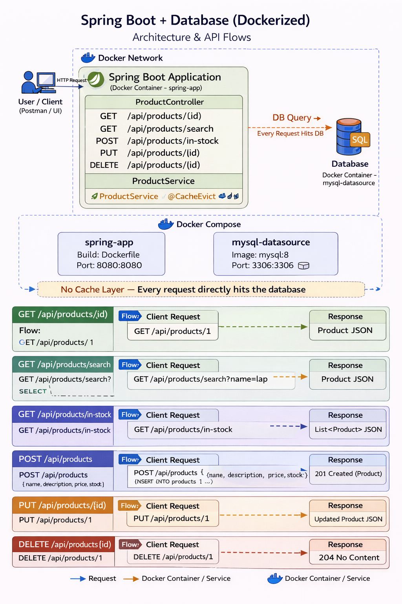

# 🌱 Spring Boot Setup and Containerisation

## 🎯 Goal

---
Take a real Spring Boot REST API with PostgreSQL and containerise it
properly using a multi-stage Dockerfile and Spring profiles.
Understand how the app switches between local and Docker configuration
without changing any code.

## 🧠 What This Project Does

---
A simple Products REST API backed by PostgreSQL.
Every product has a name, description, price and stock quantity.
The API supports full CRUD — create, read, update and delete.

## 🏗️ Architecture

---
<p align="center">
  
</p>

## 📁 Project Structure

---
```
spring-docker-app/
├── docs/
│   └── architecture-basic.png                    architecture diagram
├── src/
│   ├── main/
│   │   ├── java/com/dockyard/springdockerapp/
│   │   │   ├── SpringDockerAppApplication.java   entry point
│   │   │   ├── entity/
│   │   │   │   └── Product.java                  database table mapping
│   │   │   ├── repository/
│   │   │   │   └── ProductRepository.java        database queries
│   │   │   ├── service/
│   │   │   │   └── ProductService.java           business logic
│   │   │   └── controller/
│   │   │       └── ProductController.java        HTTP endpoints
│   │   └── resources/
│   │       ├── application.yml                   base config (local)
│   │       └── application-docker.yml            docker profile config
│   └── test/
├── Dockerfile                                    multi-stage build
├── docker-compose.yml                            full stack setup
├── .dockerignore                                 exclude junk from build
├── .gitignore
├── README.md                                     you are here
├── RUNNING.md                                    steps to run the application(locally & in docker)
└── pom.xml
```

## 🌱 How Spring Profiles Work

---
```
application.yml                 base configuration, always loaded
application-docker.yml          loaded on top when profile = docker

Local run in IntelliJ:
  Uses application.yml
  Connects to localhost:5432 (your local PostgreSQL)

Docker run:
  Uses application.yml + application-docker.yml
  application-docker.yml overrides the database URL
  to use "postgres" hostname instead of "localhost"
  Docker DNS resolves "postgres" to the postgres container IP

You never change code between environments.
Only configuration changes.
```

## 🔗 API Endpoints

---
| Method | URL                               | What it does               |
|--------|-----------------------------------|----------------------------|
| GET    | /api/products                     | Get all products           |
| GET    | /api/products/{id}                | Get one product by ID      |
| POST   | /api/products                     | Create a new product       |
| PUT    | /api/products/{id}                | Update a product           |
| DELETE | /api/products/{id}                | Delete a product           |
| GET    | /api/products/search?maxPrice=100 | Products under a price     |
| GET    | /api/products/in-stock            | Products with stock > 0    |
| GET    | /actuator/health                  | App health check           |
| GET    | /actuator/health/liveness         | Kubernetes liveness probe  |
| GET    | /actuator/health/readiness        | Kubernetes readiness probe |

## 💡 Interview Questions

---
**Q: What is a Spring profile and why is it useful in Docker?**
> A profile is a named set of configuration that activates in specific
environments. application-docker.yml activates when the docker profile
is set. This lets the app connect to postgres by container name in
Docker and localhost when running locally without changing any code.

**Q: What is Spring Data JPA and what does it do?**
> It is a Spring abstraction over JPA and Hibernate. It generates
database queries automatically from repository method names.
findByName() generates SELECT FROM products WHERE name equals
without writing any SQL.

**Q: What is Spring Boot Actuator?**
> A library that adds production ready endpoints to your app.
The health endpoint shows if the app and its dependencies are up.
Kubernetes uses the liveness and readiness endpoints to manage
pod lifecycle automatically.

**Q: What is the difference between liveness and readiness probes?**
> Liveness checks if the app is alive — failure causes a restart.
Readiness checks if the app is ready for traffic — failure removes
it from the load balancer without restarting it. An app can be
alive but not ready, for example during startup or when the
database connection pool is exhausted.