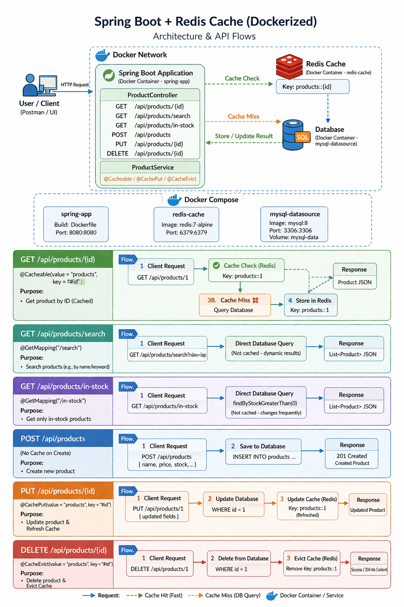

# Redis Caching

## 🎯 Goal

---
Add Redis caching to the Spring Boot Products API.
Understand what caching is, why it matters, and prove it is working
by watching database queries disappear after the first request.

## ⚡ What Is Caching and Why It Matters

---
```
WITHOUT CACHE
 
  Client → GET /api/products/1
  App    → SELECT * FROM products WHERE id = 1  (hits database)
  App    → returns product
 
  Client → GET /api/products/1  (same request again)
  App    → SELECT * FROM products WHERE id = 1  (hits database AGAIN)
  App    → returns product
 
  Every request hits the database even when the data has not changed.
  For read-heavy endpoints this is wasteful and slow.
 
WITH CACHE
 
  Client → GET /api/products/1
  App    → cache miss — product not in Redis yet
  App    → SELECT * FROM products WHERE id = 1  (hits database)
  App    → saves result in Redis with key "products::1"
  App    → returns product
 
  Client → GET /api/products/1  (same request again)
  App    → cache hit — product found in Redis
  App    → returns product directly from Redis
  Database is never touched on the second request
 
  Redis is much faster than PostgreSQL for simple key lookups.
  Typical database query: 5–50ms
  Typical Redis lookup:   0.1–1ms
```


## 🏗️ Architecture

---
<p align="center">
  
</p>

## 📁 Project Structure

---
```
spring-docker-app/
├── docs/
│   └── architecture-redis.png                    architecture diagram
├── src/
│   ├── main/
│   │   ├── java/com/dockyard/springdockerapp/
│   │   │   ├── SpringDockerAppApplication.java   entry point
│   │   │   ├── config/
│   │   │   │   └── RedisConfig.java              redis configuration
│   │   │   ├── entity/
│   │   │   │   └── Product.java                  database table mapping
│   │   │   ├── repository/
│   │   │   │   └── ProductRepository.java        database queries
│   │   │   ├── service/
│   │   │   │   └── ProductService.java           business logic
│   │   │   └── controller/
│   │   │       └── ProductController.java        HTTP endpoints
│   │   └── resources/
│   │       ├── application.yml                   base config (local)
│   │       └── application-docker.yml            docker profile config
│   └── test/
├── Dockerfile                                    multi-stage build
├── docker-compose.yml                            full stack setup
├── .dockerignore                                 exclude junk from build
├── .gitignore
├── README.md                                     you are here
├── RUNNING.md                                    steps to run the application(locally & in docker)
└── pom.xml
```

## 🔄 What Changed From 01-spring-setup

---
```
Added:
  config/RedisConfig.java        configures Redis as the cache provider
                                 sets TTL, key and value serialisers
 
Updated:
  service/ProductService.java    added @Cacheable on getProductById
                                 added @CachePut on updateProduct
                                 added @CacheEvict on deleteProduct
 
Updated:
  application.yml                added spring.cache.type=redis
```

Everything else is identical to `01-spring-setup`.

## The Three Caching Annotations

---
```
@Cacheable    Check Redis first. If found return cached value.
              If not found run the method, save result to Redis, return it.
              Used on READ operations.
 
@CachePut     Always run the method AND update Redis with the new result.
              Used on UPDATE operations to keep cache in sync.
 
@CacheEvict   Remove the entry from Redis.
              Used on DELETE operations so stale data is not returned.
```

## 💡 Interview Questions

---
**Q: What is caching and why is it used?**
> Caching stores the result of an expensive operation like a database
query in fast storage like Redis. Subsequent requests for the same
data are served from the cache instead of hitting the database.
This reduces database load and response time significantly.

**Q: What is the difference between @Cacheable and @CachePut?**
> @Cacheable skips the method entirely if the result is already in
the cache. @CachePut always runs the method but also updates the
cache with the new result. @Cacheable is for reads, @CachePut is
for updates to keep the cache in sync.

**Q: What is cache eviction?**
> Removing an entry from the cache. @CacheEvict does this in Spring.
Used on delete operations so the cache does not return data for
something that no longer exists in the database.

**Q: What is TTL in caching?**
> Time To Live — how long a cached entry stays before it expires
automatically. After expiry the next request goes to the database
and the result is cached again with a fresh TTL.
Set to 10 minutes in this project via RedisConfig.

**Q: What happens if Redis goes down?**
> Spring Boot falls back to hitting the database directly.
The app continues to work, just without the caching benefit.
This is why caching is a performance optimisation, not a
critical dependency.