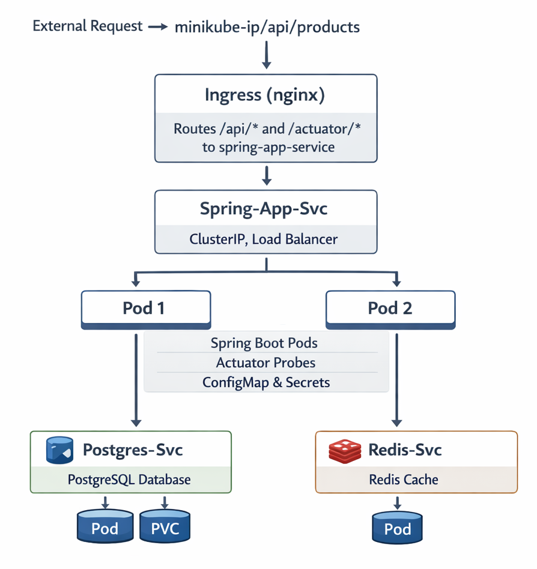

# ☸️ Spring Boot on Kubernetes

## 🎯 Goal

---
Deploy the full Spring Boot application to Kubernetes.
This brings together everything from Docker and K8s into one real production-like deployment — the complete picture.

## 🏗️ Architecture

---
<p align="center">
    
</p>

## 📁 Project Structure

---
```
01-spring-boot-k8s/
├── manifests/
│   ├── namespace.yaml        spring-app namespace
│   ├── configmap.yaml        non-sensitive config
│   ├── secret.yaml           passwords and credentials
│   ├── postgres.yaml         PostgreSQL Deployment + PVC + Service
│   ├── redis.yaml            Redis Deployment + Service
│   └── spring-app.yaml       Spring Boot Deployment + Service + Ingress
└── README.md                 you are here
```

## 🔗 How Everything Connects

---
```
ConfigMap  → Spring Boot reads DB URL, Redis host, JVM flags
Secret     → Spring Boot reads DB password
postgres   → Spring Boot connects via "postgres-service" DNS name
redis      → Spring Boot connects via "redis-service" DNS name
Ingress    → routes /api/* to spring-app-service
Probes     → real Actuator endpoints /actuator/health/liveness
                                     /actuator/health/readiness
```

## ⚠️ Before You Start

---
```
You need a Docker image of the Spring Boot app pushed to GHCR.
 
If you have not pushed it yet:
  1. Go to docker/spring-docker/03-full-compose/spring-docker-app
  2. Build the image:
     docker build -t ghcr.io/YOUR_USERNAME/backend-dockyard/spring-docker-app:latest .
  3. Push it:
     docker push ghcr.io/YOUR_USERNAME/backend-dockyard/spring-docker-app:latest
 
Then update the image field in manifests/spring-app.yaml:
  image: ghcr.io/YOUR_USERNAME/backend-dockyard/spring-docker-app:latest
```

✅ Prerequisites

---
```
# Build and push the Spring Boot image if not already done
cd docker\spring-docker\03-full-compose\spring-docker-app

docker build -t ghcr.io/YOUR_USERNAME/backend-dockyard/spring-docker-app:latest .
docker push ghcr.io/YOUR_USERNAME/backend-dockyard/spring-docker-app:latest
```

```powershell
# Start minikube
minikube start
 
# Verify cluster is ready
kubectl get nodes
# Expected: minikube   Ready   control-plane
 
# Enable Ingress addon if not already enabled
minikube addons enable ingress
 
# Wait for Ingress controller to be Running
kubectl get pods -n ingress-nginx -w
# Press Ctrl+C when ingress-nginx-controller shows Running
 
# Clean up previous exercises
kubectl delete all --all -n backend-dockyard
```

## 🚀 Deployment Steps

### Step 1 — Create the Namespace

```powershell
cd kubernetes\k8s-advanced\01-spring-boot-k8s
 
# Create the namespace first
# All other resources go inside this namespace
kubectl apply -f manifests/namespace.yaml
 
# Verify it was created
kubectl get namespaces | Select-String "spring-app"
```

### Step 2 — Apply ConfigMap and Secret

```powershell
# Apply non-sensitive config
kubectl apply -f manifests/configmap.yaml -n spring-app
 
# Apply sensitive credentials
kubectl apply -f manifests/secret.yaml -n spring-app
 
# Verify both exist
kubectl get configmap -n spring-app
kubectl get secret -n spring-app
```

### Step 3 — Deploy PostgreSQL

```powershell
# Deploy PostgreSQL with PersistentVolumeClaim and Service
kubectl apply -f manifests/postgres.yaml -n spring-app
 
# Watch the postgres Pod start
kubectl get pods -n spring-app -w
# Wait until postgres Pod shows 1/1 Running
# Press Ctrl+C then continue
 
# Verify the PVC was created and bound
kubectl get pvc -n spring-app
# STATUS should show Bound — storage is ready
```

### Step 4 — Deploy Redis

```powershell
# Deploy Redis with Service
kubectl apply -f manifests/redis.yaml -n spring-app
 
# Watch it start
kubectl get pods -n spring-app -w
# Wait until redis Pod shows 1/1 Running
```

### Step 5 — Deploy the Spring Boot App

```powershell
# Deploy Spring Boot with Service and Ingress
# Make sure you updated YOUR_USERNAME in spring-app.yaml first
kubectl apply -f manifests/spring-app.yaml -n spring-app
 
# Watch the Spring Boot Pods start
# They will show 0/1 Running while the startupProbe checks
# Spring Boot takes 30-60 seconds to fully start
kubectl get pods -n spring-app -w
# Wait until spring-app Pods show 1/1 Running
# Press Ctrl+C when both are 1/1
```

### Step 6 — Verify Everything Is Running

```powershell
# Show all resources in the namespace
kubectl get all -n spring-app
 
# Expected output:
# NAME                              READY   STATUS    RESTARTS
# pod/postgres-xxxxx                1/1     Running   0
# pod/redis-xxxxx                   1/1     Running   0
# pod/spring-app-xxxxx              1/1     Running   0
# pod/spring-app-yyyyy              1/1     Running   0
#
# NAME                      TYPE        CLUSTER-IP    PORT(S)
# service/postgres-service  ClusterIP   10.x.x.x      5432/TCP
# service/redis-service     ClusterIP   10.x.x.x      6379/TCP
# service/spring-app-svc    ClusterIP   10.x.x.x      8080/TCP
#
# NAME                         READY   UP-TO-DATE   AVAILABLE
# deployment.apps/postgres     1/1     1            1
# deployment.apps/redis        1/1     1            1
# deployment.apps/spring-app   2/2     2            2
 
# Check the Ingress
kubectl get ingress -n spring-app
```

## 🧪 Testing

---
### Test the API Through Ingress

```powershell
# Get minikube IP
minikube ip
 
# Create a product through the Ingress
curl -X POST http://localhost/api/products `
  -H "Content-Type: application/json" `
  -d "{\"name\":\"Laptop\",\"description\":\"Gaming laptop\",\"price\":999.99,\"stock\":10}"
 
# Get all products
curl http://localhost/api/products
 
# Health check through Ingress
curl http://localhost/actuator/health
# Expected: {"status":"UP","components":{"db":{"status":"UP"},"redis":{"status":"UP"}}}
```

### Verify Probes Are Working

```powershell
# Describe a spring-app Pod to see probe status
kubectl get pods -n spring-app
kubectl describe pod spring-app-xxxxx -n spring-app
# Look for: Liveness, Readiness and Startup probe sections
# Look for: Events showing probe results
 
# Check that READY shows 1/1 — readiness probe is passing
kubectl get pods -n spring-app
```

### Verify Redis Caching Works

```powershell
# First GET — hits the database
curl http://localhost/api/products/1
 
# Check logs — Hibernate SQL visible
kubectl logs -n spring-app deployment/spring-app --tail 10
 
# Second GET — served from Redis cache
curl http://localhost/api/products/1
 
# Check logs — no Hibernate SQL this time
kubectl logs -n spring-app deployment/spring-app --tail 10
 
# Inspect Redis directly
kubectl exec -it deployment/redis -n spring-app -- redis-cli KEYS *
# Expected: "products::1"
```

### Test Rolling Update

```powershell
# Update the image tag to trigger a rolling update
kubectl set image deployment/spring-app `
  spring-app=ghcr.io/YOUR_USERNAME/backend-dockyard/spring-docker-app:latest `
  -n spring-app
 
# Watch the rolling update — old Pods replaced by new ones
kubectl get pods -n spring-app -w
 
# Check rollout status
kubectl rollout status deployment/spring-app -n spring-app
```

## 🛑 Cleanup

```powershell
# Delete everything by deleting the namespace
# This removes all resources inside it in one command
kubectl delete namespace spring-app
 
# Verify
kubectl get namespaces | Select-String "spring-app"
```