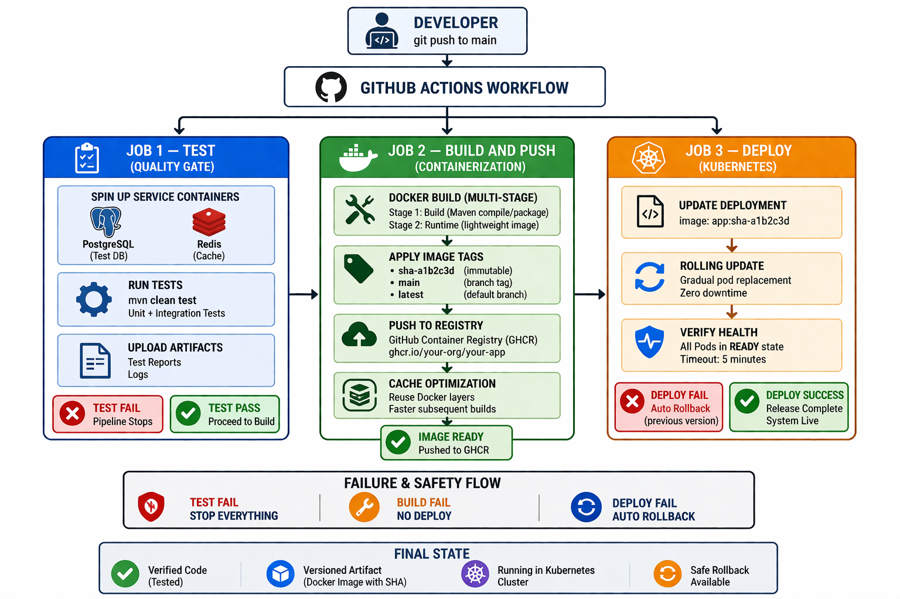

# ☸️ CI/CD Pipeline with GitHub Actions

## 🎯 Goal

---
Build a complete CI/CD pipeline that automatically tests, builds,
pushes and deploys the Spring Boot app on every push to main.
No manual steps after the initial setup.

## 🏗️ Pipeline Architecture

---
<p align="center">

</p>

## 🏷️ Why Tag With Git SHA?

---
```
Every commit gets a unique image tag: sha-a1b2c3d
 
Benefits:
  Traceability    — know exactly which code is running in production
  Rollback        — roll back to any previous commit by tag
  Auditability    — deployment history matches git history
  No ambiguity    — "latest" changes, sha never does
 
Example progression:
  commit a1b2c3d → image: sha-a1b2c3d deployed
  commit d4e5f6a → image: sha-d4e5f6a deployed
  something breaks → kubectl rollout undo → sha-a1b2c3d restored
```

## 🔙 Automatic Rollback

---
```
Deploy job fails (new Pod crashes or probe fails)
      │
      ▼
if: failure() step triggers
      │
      ▼
kubectl rollout undo deployment/spring-app
      │
      ▼
Previous image restored automatically
Pipeline marked as FAILED so you know to investigate
```

# ⚙️ Setup — One Time Only

---
### 🔑 Step 1 — Generate KUBECONFIG Secret

```powershell
# Get your kubeconfig and encode it to base64
# Run this in PowerShell
[Convert]::ToBase64String([IO.File]::ReadAllBytes("$env:USERPROFILE\.kube\config"))
 
# Copy the entire output — it will be a long string
```

### 🔐 Step 2 — Add Secret to GitHub

```
1. Go to your repo on GitHub
2. Settings → Secrets and variables → Actions
3. Click New repository secret
4. Name:  KUBECONFIG_B64
5. Value: paste the base64 string from Step 1
6. Click Add secret
```

### 📝 Step 3 — Update YOUR_USERNAME in ci-cd.yml

```
Open .github/workflows/ci-cd.yml
Find this line:
  IMAGE_NAME: ghcr.io/bhuvan-tej/backend-dockyard/spring-docker-app
 
Replace YOUR_USERNAME with your actual GitHub username
```

### 📦 Step 4 — Make the GHCR Package Public

```
1. Go to https://github.com/bhuvan-tej?tab=packages
2. Click spring-docker-app
3. Package settings → Change visibility → Public
 
This allows the Kubernetes cluster to pull the image
without needing authentication credentials
```

## 🚀 How to Trigger the Pipeline

---
```powershell
# Make any change to the Spring Boot app
# For example add a comment in ProductController.java
 
# Commit and push
git add .
git commit -m "test: trigger CI/CD pipeline"
git push origin main
 
# Go to GitHub → Actions tab
# Watch the pipeline run in real time
```

## 📊 Watching the Pipeline

---
```
GitHub → your repo → Actions tab
 
You will see three jobs running in sequence:
  🧪 Run Tests         → green when all tests pass
  🐳 Build and Push    → shows Docker build progress
  🚀 Deploy            → shows kubectl output
 
Click any job to see detailed logs including:
  Maven test output
  Docker layer build progress
  kubectl rollout status output
```

## 🔍 Verifying the Deploy Worked

---
```powershell
# After the pipeline succeeds check the running image
kubectl get pods -n spring-app -o jsonpath="{.items[*].spec.containers[*].image}"
# Should show the sha- tagged image from the latest commit
 
# Check rollout history
kubectl rollout history deployment/spring-app -n spring-app
# Shows each deployment with revision number
 
# Test the API is still working
curl http://localhost/api/products
```

## ⚠️ Important Notes From Previous Issues

---
```
1. minikube tunnel must be running for localhost to work
   Open a separate PowerShell window and keep it running:
   minikube tunnel
 
2. Ingress paths use Prefix type with no rewrite
   /api   → spring-app-service:8080
   /actuator → spring-app-service:8080
   No rewrite-target annotation needed
 
3. The pipeline deploys to your LOCAL minikube
   In real production the KUBECONFIG would point to
   a cloud cluster (AWS EKS, GCP GKE, Azure AKS)
   The pipeline steps are identical — only the kubeconfig changes
```