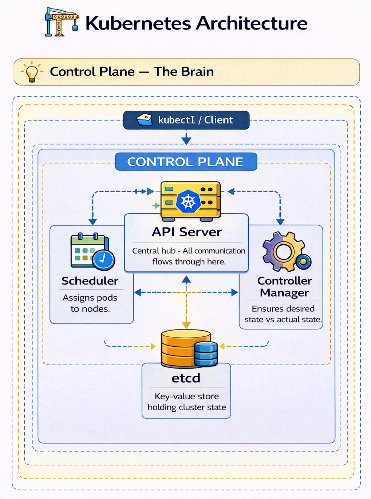
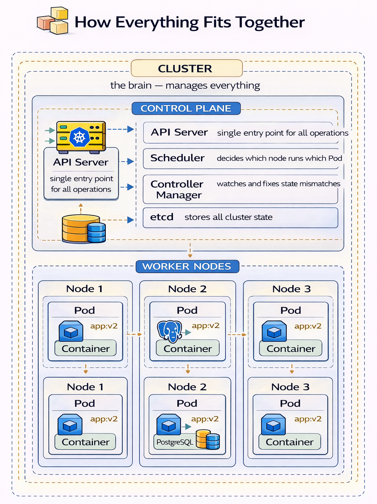
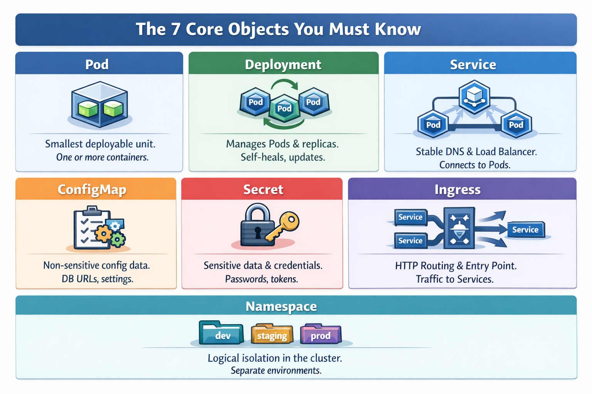
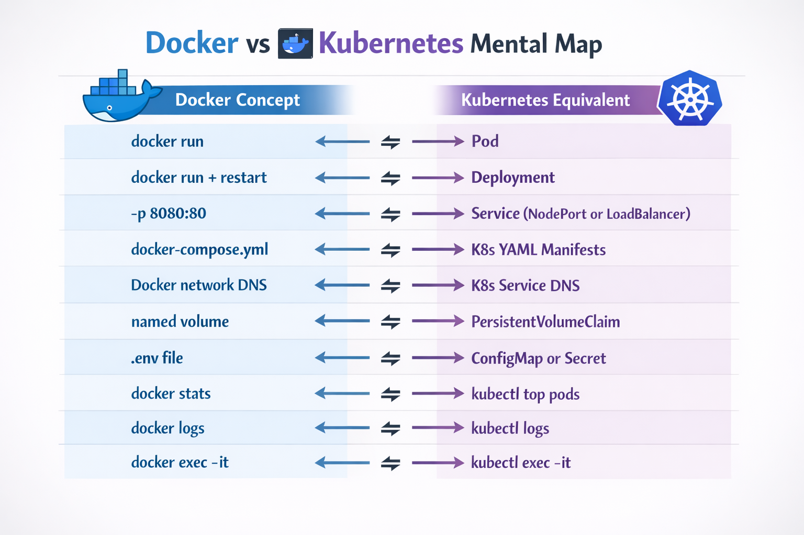

# ☸️ Kubernetes Concepts

## 🎯 Goal

---
Build a clear mental model of what Kubernetes is, why it exists,
and how all the components fit together before writing any YAML.

## 🤔 Why Kubernetes Exists

---
```
After Docker you can run containers on one machine.
Now think about what production actually needs:
 
  Traffic spikes at 9am every day
  → need to scale up automatically, scale down at night
 
  Container crashes at 3am
  → need it restarted automatically without waking anyone up
 
  Deploy new version without any downtime
  → need rolling updates
 
  Bad deploy breaks everything
  → need instant rollback in one command
 
  50 microservices across 20 servers
  → need something to decide which server runs which container
 
Docker alone cannot do any of these reliably.
Kubernetes was built specifically for these problems.
```

## 🏗️ Kubernetes Architecture

---
### 🧠 Control Plane — The Brain

<p align="center">
  
</p>


**API Server**
Every kubectl command hits this. Every component communicates through it.
Think of it as the front door to the entire cluster.

**Scheduler**
Watches for Pods that have no node assigned.
Picks the best node based on available CPU, memory and constraints.

**Controller Manager**
Watches for mismatches between desired state and actual state and fixes them.
If you want 3 replicas and one Pod crashes it creates a replacement immediately.

**etcd**
The cluster database. Stores everything — what Deployments exist,
how many replicas are desired, what Pods are running.
If etcd is lost the cluster state is lost. Always backed up in production.

## 🧱 How Everything Fits Together

<p align="center">
  
</p>

This hierarchy is fundamental.
Everything you do in Kubernetes fits into this structure.

## ⚖️ Declarative vs Imperative

---
**Imperative (traditional way):**
```
Run this container 
Restart this service 
Scale this manually
```

**Declarative (Kubernetes way):**
```
Here is the desired state (in YAML)
Kubernetes ensures reality matches your definition.
This is why YAML is central to Kubernetes.
```

## 📋 The 7 Core Objects You Must Know

---

<p align="center">
  
</p>

You define these objects using YAML files.
Kubernetes stores them in etcd and continuously ensures they match the desired state.

## ♻️ Self-Healing

---
```
Kubernetes constantly monitors the system.

If something goes wrong:

Pod crashes → recreated
Health check fails → restarted
Node dies → Pods rescheduled elsewhere

No manual intervention required.
```

## 🔄 Docker vs Kubernetes

---

<p align="center">
  
</p>