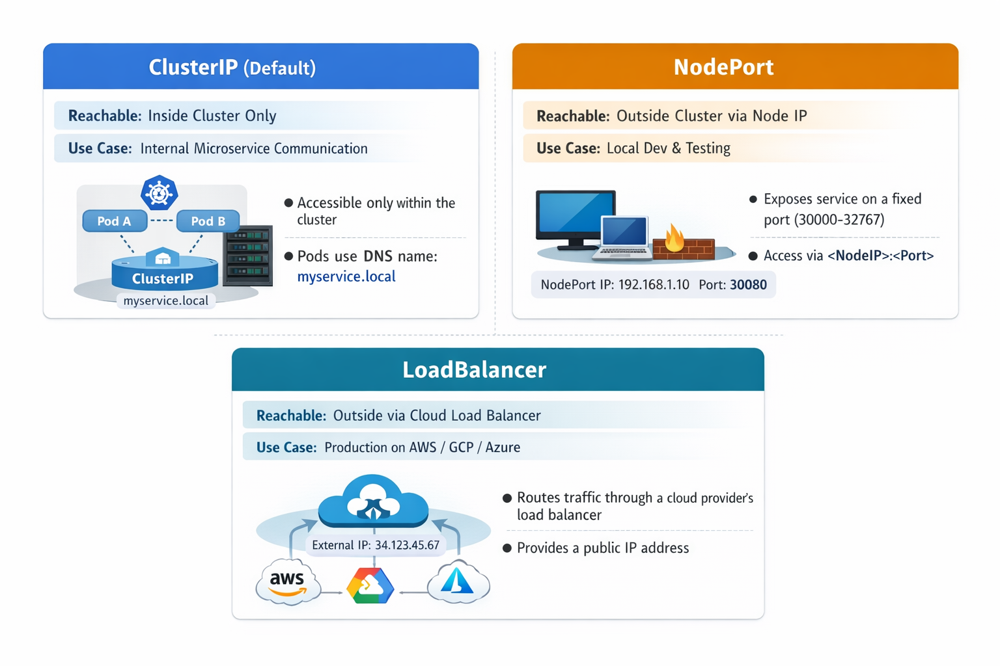

# ☸️ Services

## 🎯 Goal

---
Understand why Services exist, the difference between ClusterIP and NodePort, and how Kubernetes DNS lets Pods find each other
by name instead of IP address.

## 🤔 Why Services Exist

---
```
WITHOUT A SERVICE
 
  Pod A needs to talk to Pod B
  Pod B IP today:    172.17.0.5
  Pod B crashes and restarts
  Pod B IP tomorrow: 172.17.0.8
 
  Your hardcoded URL breaks every time a Pod restarts.
  Pods are temporary — their IPs are not reliable.
 
WITH A SERVICE
 
  Service gives Pod B a stable DNS name: my-app-service
  Pod B IP changes? Service updates automatically.
  Pod A always connects to: http://my-app-service:80
  That name never changes regardless of Pod restarts.
  Service also load balances across all matching Pods.
```

## 🗺️ Three Service Types

---
<p align="center">
  
</p>

## 🔄 How a Service Finds Its Pods

---
```
Service uses a selector to find matching Pods:
 
  Service selector:        app: my-app
  Pod labels:              app: my-app  ← matched, gets traffic
  Another Pod labels:      app: other   ← not matched, ignored
 
When you scale to 5 replicas all 5 Pods have label app: my-app
The Service automatically load balances across all 5.
When a Pod crashes and a new one starts with the same label
the Service automatically includes it.
Zero configuration needed.
```

## ⚙️ Exercises

---
### 🧪 Exercise 1 — Deploy the App First

```powershell
# The Service needs Pods to route traffic to
# Apply the Deployment from 02-pods-deployments first
kubectl apply -f ../02-pods-deployments/deployment.yaml -n backend-dockyard
 
# Verify Pods are running before creating Services
kubectl get pods -n backend-dockyard
```

### 🔗 Exercise 2 — Create a ClusterIP Service

```powershell
# Apply the ClusterIP Service
kubectl apply -f service-clusterip.yaml -n backend-dockyard
 
# List all Services in the namespace
kubectl get services -n backend-dockyard
# or shorter
kubectl get svc -n backend-dockyard
 
# See full Service details including which Pods it is routing to
kubectl describe service my-app-service -n backend-dockyard
# Look for the Endpoints section — shows the Pod IPs being used
```

### 🌐 Exercise 3 — Prove ClusterIP DNS Works

```powershell
# ClusterIP is not accessible from your Windows machine
# But other Pods inside the cluster can reach it by name
 
# Start a temporary Pod just to test connectivity
# --rm removes it automatically when you exit
# -it opens an interactive terminal
# alpine is a tiny Linux image good for testing
kubectl run test-pod --rm -it `
  --image=alpine `
  --restart=Never `
  -n backend-dockyard `
  -- sh
 
# Inside the test Pod — you are now inside the cluster
# Use wget to hit the Service by its DNS name
# my-app-service resolves to the ClusterIP automatically
wget -qO- http://my-app-service:80
# You should see the nginx welcome page HTML
 
# The DNS name format inside a cluster is:
# service-name.namespace.svc.cluster.local
# Short form works within the same namespace:
# my-app-service
wget -qO- http://my-app-service.backend-dockyard.svc.cluster.local
 
# Exit the test Pod — it auto-removes itself
exit
```

### 🚪 Exercise 4 — Create a NodePort Service

```powershell
# Apply the NodePort Service
kubectl apply -f service-nodeport.yaml -n backend-dockyard
 
# List Services — you will see both ClusterIP and NodePort
kubectl get svc -n backend-dockyard
 
# See NodePort details
kubectl describe service my-app-nodeport -n backend-dockyard
```

### 🖥️ Exercise 5 — Access the App From Your Windows Machine

```powershell
# minikube service opens the NodePort Service in your browser
# It finds the minikube node IP and the nodePort automatically
minikube service my-app-nodeport -n backend-dockyard
 
# Or get the URL to use with curl
minikube service my-app-nodeport -n backend-dockyard --url
 
# Use the URL from above with curl
# Replace the URL with what minikube printed
curl http://MINIKUBE-IP:30080
# You should see the nginx welcome page
```

### ⚖️ Exercise 6 — See Load Balancing in Action

```powershell
# Get the Pod names
kubectl get pods -n backend-dockyard
 
# Watch Pod logs in separate terminals to see which Pod handles each request
# Open a new IntelliJ terminal for each Pod
kubectl logs -f my-app-xxxxx-xxxxx -n backend-dockyard
kubectl logs -f my-app-yyyyy-yyyyy -n backend-dockyard
kubectl logs -f my-app-zzzzz-zzzzz -n backend-dockyard
 
# Send multiple requests from another terminal
# Watch which Pods log each request — load is distributed
$url = $(minikube service my-app-nodeport -n backend-dockyard --url)
curl $url
curl $url
curl $url
curl $url
curl $url
```

### 🔍 Exercise 7 — Port Forward for Quick Access

```powershell
# kubectl port-forward is another way to access Services locally
# Forwards your local port 8080 to the Service port 80
# Useful for quick testing without creating a NodePort
kubectl port-forward service/my-app-service 8080:80 -n backend-dockyard
 
# In another terminal — access via the forwarded port
curl http://localhost:8080
# Press Ctrl+C in the first terminal to stop forwarding
```

### 🛑 Exercise 8 — Clean Up

```powershell
# Delete both Services
kubectl delete -f service-clusterip.yaml -n backend-dockyard
kubectl delete -f service-nodeport.yaml -n backend-dockyard
 
# Delete the Deployment
kubectl delete -f ../02-pods-deployments/deployment.yaml -n backend-dockyard
 
# Verify everything is gone
kubectl get all -n backend-dockyard
```