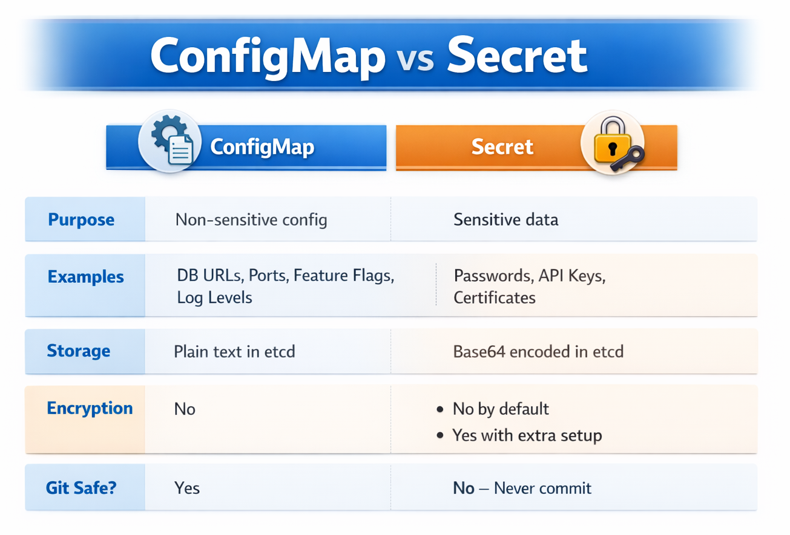

# ☸️ ConfigMap and Secret

## 🎯 Goal

---
Understand how to externalize configuration from your Docker image
using ConfigMaps and Secrets. Inject them into Pods as environment
variables and prove the values are available inside the container.

## 🤔 Why Externalise Configuration?

---
```
WITHOUT ConfigMap and Secret
 
  Database URL, passwords and settings are baked into the image
  Different environments need different images
  Changing a password means rebuilding and redeploying
  Secrets end up in your Dockerfile or source code
 
WITH ConfigMap and Secret
 
  Configuration lives in the cluster, separate from the image
  Same image runs in dev, staging and production
  Change config without touching the image
  Secrets are stored separately from application code
```

## 🗺️ ConfigMap vs Secret

---
<p align="center">
  
</p>

## 🔑 Two Ways to Inject Config Into a Pod

---
```
METHOD 1 — envFrom
  Loads ALL keys from a ConfigMap or Secret as env vars
  One line per ConfigMap or Secret
  Every key becomes an environment variable
 
METHOD 2 — env with valueFrom
  Loads specific keys one by one
  Lets you rename the key to a different env var name
  More verbose but more explicit
```

## ⚠️ Config Update Behavior

---
```
Environment variables are loaded at Pod startup
Updating ConfigMap or Secret:
    Does NOT update running Pods
    Requires restart
```

## 📂 Alternative: Mount as Files

---
```
ConfigMap/Secret → mounted as files inside container
Use when:
    Large configs
    Dynamic reload needed
```

## 🔐 Security Reality

---
```
Secrets are NOT encrypted by default
Base64 encoding ≠ security
Anyone with access can decode

Production requires:
    Encryption at rest
    RBAC controls
    External secret management
```

## ✅ Prerequisites

---
```powershell
# Start minikube if not already running
minikube start
 
# Verify cluster is ready
kubectl get nodes
# Expected: minikube   Ready   control-plane
 
# Verify namespace exists — recreate if missing
kubectl get namespaces | Select-String "backend-dockyard"
kubectl create namespace backend-dockyard
```

## ⚙️ Exercises

---
### 🧪 Exercise 1 — Create the ConfigMap

```powershell
# Navigate to the folder
cd kubernetes\k8s-intermediate\01-configmap-secret
 
# Apply the ConfigMap
kubectl apply -f configmap.yaml -n backend-dockyard
 
# List ConfigMaps in the namespace
kubectl get configmap -n backend-dockyard
# or shorter
kubectl get cm -n backend-dockyard
 
# See the full ConfigMap including all key-value pairs
kubectl describe configmap app-config -n backend-dockyard
 
# Get the raw YAML of the ConfigMap
# Useful to verify what is stored in the cluster
kubectl get configmap app-config -n backend-dockyard -o yaml
```

### 🔐 Exercise 2 — Create the Secret

```powershell
# Apply the Secret
kubectl apply -f secret.yaml -n backend-dockyard
 
# List Secrets
kubectl get secret -n backend-dockyard
 
# Describe the Secret
# Notice: values are hidden — shows only the byte count not the value
kubectl describe secret app-secret -n backend-dockyard
 
# Get the raw YAML — values show as base64 encoded strings
kubectl get secret app-secret -n backend-dockyard -o yaml
 
# Decode a specific value to verify it is correct
# -o jsonpath extracts one field from the output
# The piped base64 -d decodes it
kubectl get secret app-secret -n backend-dockyard `
  -o jsonpath="{.data.DB_PASSWORD}" | `
  % { [Text.Encoding]::UTF8.GetString([Convert]::FromBase64String($_)) }
# Expected output: apppass
```
 
---

### 🚀 Exercise 3 — Deploy With Config Injected

```powershell
# Apply the Deployment that reads from ConfigMap and Secret
kubectl apply -f deployment-with-config.yaml -n backend-dockyard
 
# Watch Pods start
kubectl get pods -n backend-dockyard -w
# Press Ctrl+C when both show Running
```
 
---

### 🔍 Exercise 4 — Prove Config Is Injected Into the Pod

```powershell
# Get a Pod name
kubectl get pods -n backend-dockyard
 
# Shell into a running Pod
# Replace my-app-with-config-xxxxx with actual Pod name
kubectl exec -it my-app-with-config-xxxxx -n backend-dockyard -- sh
 
# Inside the Pod — check environment variables
# All ConfigMap and Secret keys are available as env vars
env | grep APP_NAME
env | grep DB_URL
env | grep DB_PASSWORD
env | grep SPRING_DATASOURCE_URL
env | grep SPRING_DATASOURCE_PASSWORD
env | grep API_KEY
 
# Print all env vars to see everything injected
env
 
# Exit the Pod
exit
```
 
---

### 🔄 Exercise 5 — Update ConfigMap Without Rebuilding

```powershell
# Change a value in the ConfigMap
# Edit LOG_LEVEL from INFO to DEBUG
kubectl edit configmap app-config -n backend-dockyard
# This opens the ConfigMap in your default editor
# Change INFO to DEBUG under LOG_LEVEL
# Save and close the editor
 
# Verify the change
kubectl describe configmap app-config -n backend-dockyard
# LOG_LEVEL should now show DEBUG
 
# Restart the Pods to pick up the new config
# rollout restart creates new Pods with the updated config
kubectl rollout restart deployment/my-app-with-config -n backend-dockyard
 
# Shell into a new Pod and verify
kubectl get pods -n backend-dockyard
kubectl exec -it my-app-with-config-xxxxx -n backend-dockyard -- sh
env | grep LOG_LEVEL
# Expected: LOG_LEVEL=DEBUG
exit
```
 
---

### 🛑 Exercise 6 — Clean Up

```powershell
# Delete all resources created in this section
kubectl delete -f deployment-with-config.yaml -n backend-dockyard
kubectl delete -f configmap.yaml -n backend-dockyard
kubectl delete -f secret.yaml -n backend-dockyard
 
# Verify everything is gone
kubectl get all -n backend-dockyard
kubectl get cm -n backend-dockyard
kubectl get secret -n backend-dockyard
```