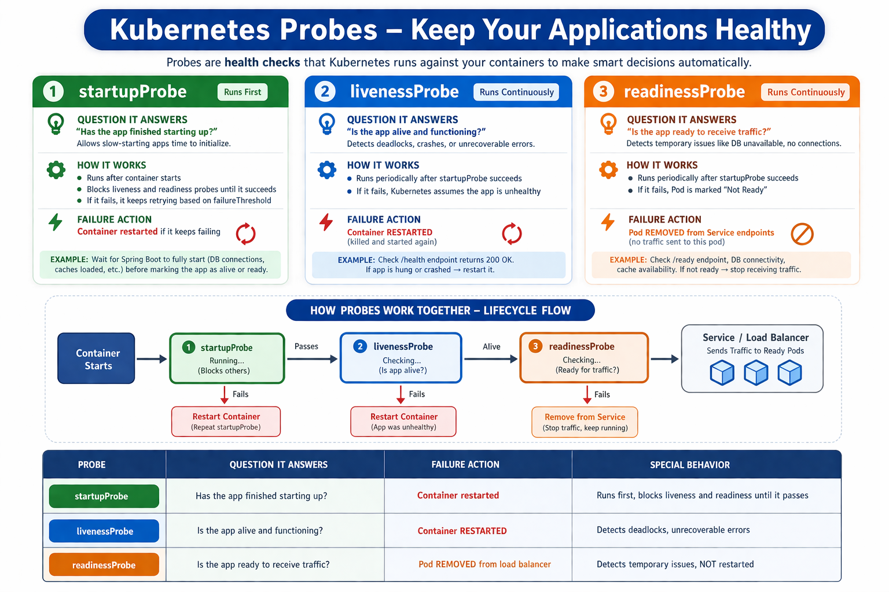
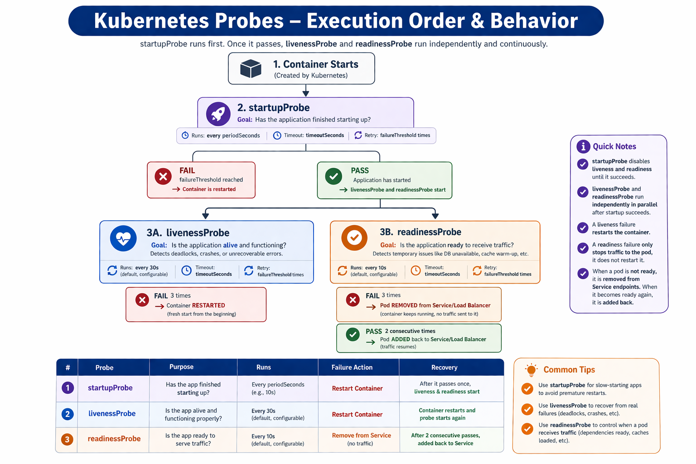

# ☸️ Probes

## 🎯 Goal

---
Understand why probes exist, the difference between all three probe
types, and how Spring Boot Actuator maps directly to Kubernetes probes.
All exercises use
nginx so everything works immediately without any setup.

> 📌 Spring Boot Actuator probes (`/actuator/health/liveness` and
> `/actuator/health/readiness`) are covered in k8s-advanced when
> the full Spring Boot app is deployed to Kubernetes.

## 🤔 Why Probes Exist

---
```
Container is running ≠ application is healthy

WITHOUT PROBES
 
  Container process is running
  Kubernetes sees: process is up = all good
  But inside the app:
    Spring Boot is still loading beans (not ready for traffic)
    Deadlock occurred (app is alive but broken)
    Database connection pool exhausted (cannot serve requests)
 
  Kubernetes has no visibility into any of this.
  It keeps sending traffic to a broken app.
  Users get errors.
 
WITH PROBES
 
  Kubernetes actively checks if the app is healthy
  Uses HTTP calls to your Actuator endpoints
  Takes automatic action based on the result
  No manual intervention needed
```

## 🔍 The Three Probes

---
<p align="center">
  
</p>

## 🔗 How Readiness Affects Traffic

---
```
Service → sends traffic only to READY Pods

If readiness fails:
    Pod removed from load balancer
    No new requests sent to this Pod
    Other healthy Pods keep serving

If readiness recovers:
    Pod added back automatically
    Traffic resumes
    Zero manual intervention
```

## ⏱️ Probe Execution Order

---
<p align="center">
  
</p>

## 🌱 Spring Boot Actuator Integration

---
```
Spring Boot exposes dedicated endpoints for each probe:
 
  /actuator/health/liveness    → used by livenessProbe and startupProbe
  /actuator/health/readiness   → used by readinessProbe
 
These are enabled in application.yml:
 
  management:
    endpoint:
      health:
        probes:
          enabled: true
    health:
      livenessstate:
        enabled: true
      readinessstate:
        enabled: true
 
Liveness returns DOWN when:
  App is in an unrecoverable state
  Out of memory
  Deadlock detected
 
Readiness returns DOWN when:
  Database connection unavailable
  Cache not warmed up
  App is still processing startup tasks
  Downstream service unhealthy
```

## 🔐 Security Reality

---
```
Actuator endpoints expose internal app state.
In production restrict access:
 
  management:
    server:
      port: 8081           # separate management port
    endpoints:
      web:
        exposure:
          include: health  # only expose health, not all endpoints
 
Kubernetes probes reach the management port internally.
External traffic only reaches port 8080.
Metrics and other sensitive endpoints are never exposed outside.
```

## ✅ Prerequisites

```powershell
# Start minikube if not already running
minikube start
 
# Verify cluster is ready
kubectl get nodes
# Expected: minikube   Ready   control-plane
 
# Verify namespace exists
kubectl get namespaces | Select-String "backend-dockyard"
 
# If missing recreate it
kubectl create namespace backend-dockyard
 
# Clean up anything left from previous exercises
kubectl delete all --all -n backend-dockyard
```
 
---

## ⚙️ Exercises

### 🧪 Exercise 1 — Deploy and Watch Probes Pass

```powershell
# Navigate to the folder
cd kubernetes\k8s-intermediate\02-probes
 
# Apply the Deployment
kubectl apply -f deployment-with-probes.yaml -n backend-dockyard
 
# Watch Pods starting
# READY column shows 0/1 until readiness probe passes
# then switches to 1/1
kubectl get pods -n backend-dockyard -w
# Press Ctrl+C when both show 1/1 Running
```
 
---

### 🔍 Exercise 2 — Inspect Probe Configuration on a Running Pod

```powershell
# Get Pod names
kubectl get pods -n backend-dockyard
 
# Describe a Pod — scroll down to find three sections:
#   Liveness:   shows probe type, path, port, timing config
#   Readiness:  shows probe type, path, port, timing config
#   Startup:    shows probe type, path, port, timing config
# Also look at Events at the bottom showing probe activity
kubectl describe pod probe-demo-xxxxx -n backend-dockyard
```
 
---

### 💥 Exercise 3 — Simulate a Liveness Failure

```powershell
# Edit the deployment live in the cluster
# Change the liveness probe path to something that does not exist
kubectl edit deployment probe-demo -n backend-dockyard
# Find livenessProbe → httpGet → path
# Change / to /this-does-not-exist
# Save and close the editor
 
# Watch what happens
# After 3 failures (3 x 20s = 60s) you will see:
#   RESTARTS column increases
#   Pod briefly goes to Error then back to Running
kubectl get pods -n backend-dockyard -w
 
# See the failure events
kubectl describe pod probe-demo-xxxxx -n backend-dockyard
# Look for: Liveness probe failed: HTTP probe failed with statuscode: 404
 
# Fix it — change the path back to /
kubectl edit deployment probe-demo -n backend-dockyard
```
 
---

### 🚦 Exercise 4 — Simulate a Readiness Failure

```powershell
# Edit the deployment
# Change the readiness probe path to something that does not exist
kubectl edit deployment probe-demo -n backend-dockyard
# Find readinessProbe → httpGet → path
# Change / to /not-ready
# Save and close
 
# Watch what happens
# READY column drops from 1/1 to 0/1
# Pod stays Running but is removed from load balancer
# RESTARTS column stays the same — no restart on readiness failure
kubectl get pods -n backend-dockyard -w
 
# See the failure events
kubectl describe pod probe-demo-xxxxx -n backend-dockyard
# Look for: Readiness probe failed: HTTP probe failed with statuscode: 404
 
# Fix it — change the path back to /
kubectl edit deployment probe-demo -n backend-dockyard
 
# Watch READY go from 0/1 back to 1/1 after 2 consecutive successes
kubectl get pods -n backend-dockyard -w
```
 
---

### 📊 Exercise 5 — Watch Events in Real Time

```powershell
# In one terminal — watch pod status
kubectl get pods -n backend-dockyard -w
 
# In another terminal — watch events sorted by time
# Shows probe failures and successes as they happen
kubectl get events -n backend-dockyard --sort-by=".lastTimestamp" -w
```
 
---

### 🛑 Exercise 6 — Clean Up

```powershell
# Delete the Deployment
kubectl delete -f deployment-with-probes.yaml -n backend-dockyard
 
# Verify clean
kubectl get all -n backend-dockyard
# Expected: No resources found
```