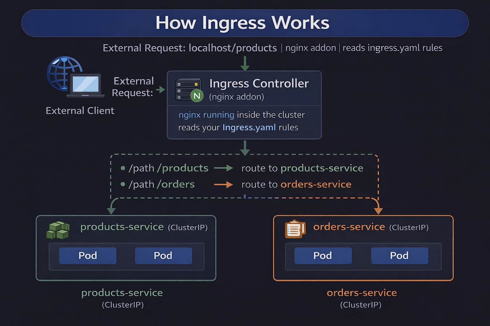

# ☸️ Ingress

## 🎯 Goal

---
Understand what Ingress is, why it exists, and how it routes traffic to multiple backend services using a single entry point.
Deploy two services and route to them using path-based routing.

## 🤔 Why Ingress Exists

---
```
WITHOUT INGRESS
 
  Each service needs its own NodePort:
    products-service → NodePort 30001
    orders-service   → NodePort 30002
    users-service    → NodePort 30003
    payments-service → NodePort 30004
 
  Problems:
    Clients need to know which port maps to which service
    Dozens of open ports to manage and secure
    No clean URLs — localhost:30001 instead of localhost/products
    SSL needs to be configured on every service separately
 
WITH INGRESS
 
  Single entry point on port 80
  Clean path-based routing:
    localhost/products → products-service
    localhost/orders   → orders-service
  SSL configured once at the Ingress level
  One place to manage all routing rules
```

## 🧠 What Kubernetes Actually Does

---
```
Ingress is just a configuration object.
It does NOT handle traffic itself.
Client → Ingress Controller → Service → Pod

👉 The Ingress Controller (nginx in minikube) reads your rules
👉 Then routes traffic accordingly
```

## 🏗️ How Ingress Works

---
<p align="center">
    
</p>

## 🔄 Ingress vs NodePort vs LoadBalancer

```
┌──────────────────┬───────────────────────────────┬──────────────────┐
│ TYPE             │ HOW IT WORKS                  │ USE CASE         │
├──────────────────┼───────────────────────────────┼──────────────────┤
│ NodePort         │ Opens a port on every node    │ Local dev only   │
│                  │ localhost:30080               │                  │
├──────────────────┼───────────────────────────────┼──────────────────┤
│ LoadBalancer     │ Cloud provider creates an     │ Single service   │
│                  │ external load balancer        │ in production    │
│                  │ One IP per service            │ Expensive        │
├──────────────────┼───────────────────────────────┼──────────────────┤
│ Ingress          │ One entry point routes to     │ Multiple services│
│                  │ multiple services by path     │ in production    │
│                  │ or hostname                   │ Most common      │
└──────────────────┴───────────────────────────────┴──────────────────┘
```

## 🔀 Path-Based vs Host-Based Routing

---
```
PATH-BASED (what we use here)
  Same hostname, different paths
  localhost/products → products-service
  localhost/orders   → orders-service
 
HOST-BASED (used in production)
  Different hostnames, different services
  api.myapp.com      → api-service
  admin.myapp.com    → admin-service
  www.myapp.com      → frontend-service
 
Both can be combined in one Ingress.
```

## ⚠️ URL Rewriting

---
```
Without rewrite-target annotation:
  Request arrives:  GET /products
  Forwarded as:     GET /products to the Service
  nginx inside Pod serves content at /
  /products returns 404
 
With rewrite-target: /$1
  Request arrives:  GET /products
  Regex captures:   everything after /products
  Forwarded as:     GET / to the Service
  nginx returns 200 with the index.html
 
This is why the annotation is needed for path-based routing.
Without it every path except / returns 404.
```

## 🔗 Full Traffic Flow

---
> Client → Ingress → Service → Pod

👉 Ingress never talks directly to Pods

👉 Services are mandatory

## ✅ Prerequisites

---
```powershell
# Start minikube if not already running
minikube start
 
# Enable the nginx Ingress controller addon
# This installs nginx inside the cluster to handle Ingress rules
minikube addons enable ingress
 
# Wait for the Ingress controller Pod to be Running
# This can take 1-2 minutes
kubectl get pods -n ingress-nginx -w
# Press Ctrl+C when you see ingress-nginx-controller   Running
 
# Verify namespace exists
kubectl get namespaces | Select-String "backend-dockyard"
 
# If missing recreate it
kubectl create namespace backend-dockyard
 
# Clean up anything from previous exercises
kubectl delete all --all -n backend-dockyard
```

---

## ⚙️ Exercises

---
### 🧪 Exercise 1 — Deploy the Two Apps and Services

```powershell
# Navigate to the folder
cd kubernetes\k8s-intermediate\03-ingress
 
# Apply the Deployment and Service file
# This creates: products-app, products-service, orders-app, orders-service
kubectl apply -f deployment-service.yaml -n backend-dockyard
 
# Watch all Pods start
kubectl get pods -n backend-dockyard -w
# Press Ctrl+C when all four Pods show 1/1 Running
 
# Verify Services were created
kubectl get services -n backend-dockyard
# Expected: products-service and orders-service both ClusterIP
```

### 🚦 Exercise 2 — Create the Ingress

```powershell
# Apply the Ingress routing rules
kubectl apply -f ingress.yaml -n backend-dockyard
 
# Check the Ingress was created
kubectl get ingress -n backend-dockyard
 
# See full Ingress details including routing rules
kubectl describe ingress app-ingress -n backend-dockyard
# Look for Rules section showing path → service mappings
```

### 🌐 Exercise 3 — Get the minikube IP and Test Routing

```powershell
# Get the minikube cluster IP
# This is the IP address of the minikube node
minikube ip
# Note this IP — replace MINIKUBE-IP below with the actual value
 
# Test products route
# /products should route to products-service
curl http://localhost/products
# Expected: <h1>Products Service</h1>
 
# Test orders route
# /orders should route to orders-service
curl http://localhost/orders
# Expected: <h1>Orders Service</h1>
 
# Test that an unknown path returns 404
curl http://localhost/unknown
# Expected: 404 Not Found from nginx
```

### 🔍 Exercise 4 — Inspect the Ingress Controller Logs

```powershell
# Get the Ingress controller Pod name
kubectl get pods -n ingress-nginx
 
# Follow the Ingress controller logs
# See each request being routed to the correct service
kubectl logs -f ingress-nginx-controller-xxxxx -n ingress-nginx
 
# In another terminal make requests
curl http://localhost/products
curl http://localhost/orders
# Watch the logs show which backend each request went to
```
 
---

### ➕ Exercise 5 — Add a New Route Without Changing Services

```powershell
# Edit the Ingress to add a third route
kubectl edit ingress app-ingress -n backend-dockyard
 
# Add this under the existing paths:
#   - path: /health(/|$)(.*)
#     pathType: ImplementationSpecific
#     backend:
#       service:
#         name: products-service
#         port:
#           number: 80
 
# Save and close
 
# Test the new route immediately — no restart needed
curl http://$(minikube ip)/health
# Expected: <h1>Products Service</h1>
 
# This shows how Ingress rules can be updated live
# without touching the underlying services or deployments
```
 
---

### 🛑 Exercise 6 — Clean Up

```powershell
# Delete all resources
kubectl delete -f ingress.yaml -n backend-dockyard
kubectl delete -f deployment-service.yaml -n backend-dockyard
 
# Verify clean
kubectl get all -n backend-dockyard
kubectl get ingress -n backend-dockyard
```