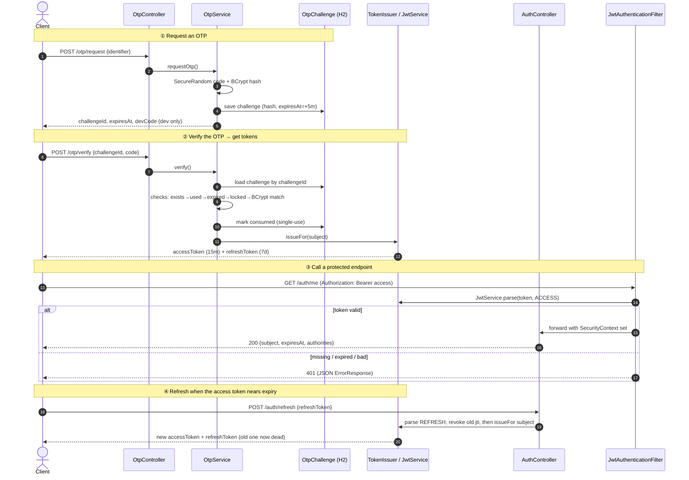

# 🔐 OTP + JWT Auth

## 🎯 Goal

---
Build a **production-shaped passwordless authentication service**. A user proves
they own an identifier (email/phone) with a **one-time password**, and in return
gets a pair of **JWTs** — a short-lived access token and a long-lived refresh
token.

The theme of this project is **validity and expiry done right**. Three different
secrets expire on three different clocks, each enforced server-side:

| Secret            | Lifetime (default) | Enforced by                         |
|-------------------|--------------------|-------------------------------------|
| **OTP**           | 5 minutes          | `expiresAt` on the challenge row    |
| **Access token**  | 15 minutes         | JWT `exp` claim, checked every call |
| **Refresh token** | 7 days             | JWT `exp` claim, checked on refresh |

Like the QR project, the point isn't the library — it's a clean, layered design
where the third-party engine (here **JJWT**) is fully isolated, every input is
validated, every error is consistent, and the whole thing runs with **zero
external setup** (in-memory H2, dev-mode OTP echo).

## 💡 Why This Is a Real-World Pattern

---
"Login with an OTP, then use a token" is how most modern apps work — banking
apps, food delivery, ride-hailing, any "enter the code we texted you" flow. The
two-token JWT model behind it is the same one used by OAuth2 / OIDC:

- **Access token** is sent on *every* request. It's short-lived so that if it
  leaks, it's only dangerous for minutes.
- **Refresh token** is sent *only* to get a new access token. It lives long, so
  the user isn't forced to re-authenticate constantly.

This project implements that end to end, including the security guardrails a real
system needs: OTPs are **hashed** (never stored in clear), **single-use**,
**attempt-limited**, and **resend-throttled**.

## 🏗️ Architecture

---
```
HTTP Request
      │
      ▼
OtpController / AuthController   validate (@Valid), shape the HTTP response
      │                          thin — no business logic, no JWT here
      ▼
OtpService / AuthService         business rules: cooldown, expiry, attempts,
      │                          single-use, then issue tokens
      ├───────────────► OtpGenerator     SecureRandom numeric code
      ├───────────────► PasswordEncoder  BCrypt hash of the code (store the hash)
      ├───────────────► TokenIssuer ──► JwtService   the ONLY class that touches JJWT
      ▼
OtpChallengeRepository           Spring Data JPA — the challenge + its expiry
      │
      ▼
H2 (in-memory)                   otp_challenges table (hash + metadata, no code)

     ┌─────────────────────────────────────────────────────────────────┐
     │  Every protected request also passes through:                   │
     │  JwtAuthenticationFilter → JwtService.parse() → SecurityContext │
     └─────────────────────────────────────────────────────────────────┘
```

### Request flow (sequence)



**The key design decision (same as QR's ZXing isolation):** every JJWT type lives
in exactly one file — `JwtService`. The filter, services and controllers depend
on our own `ParsedToken`, never on `io.jsonwebtoken.*`. Swapping the JWT library
or moving to opaque tokens touches one file.

## 📁 Project Structure

---
```
otp-auth/
├── src/main/java/com/dockyard/otpauth/
│   ├── OtpAuthApplication.java            entry point (+ @EnableConfigurationProperties)
│   ├── config/
│   │   ├── SecurityConfig.java            stateless JWT filter chain + BCrypt bean
│   │   ├── OpenApiConfig.java             Swagger UI + Bearer auth button
│   │   ├── OtpProperties.java             otp.* rules (length, ttl, attempts…)
│   │   └── JwtProperties.java             jwt.* secret, issuer, token lifetimes
│   ├── controller/
│   │   ├── OtpController.java             POST /otp/request, /otp/verify  (public)
│   │   └── AuthController.java            POST /auth/refresh (public), GET /auth/me (protected)
│   ├── domain/
│   │   ├── OtpPurpose.java                LOGIN / SIGNUP / PASSWORD_RESET / TRANSACTION
│   │   └── DeliveryChannel.java           EMAIL / SMS
│   ├── dto/
│   │   ├── OtpRequest.java                identifier + purpose + channel (+ validation)
│   │   ├── OtpChallengeResponse.java      challengeId, expiry, ttl, devCode (dev only)
│   │   ├── OtpVerifyRequest.java          challengeId + code
│   │   ├── TokenResponse.java             access + refresh + lifetimes
│   │   ├── RefreshRequest.java            refreshToken
│   │   └── MeResponse.java                subject + token expiry + authorities
│   ├── entity/
│   │   ├── OtpChallenge.java              otp_challenges table (BCrypt hash, expiresAt…)
│   │   └── RefreshToken.java              refresh_tokens table (jti, revoked) for rotation
│   ├── exception/
│   │   ├── ErrorResponse.java             consistent error shape
│   │   ├── ChallengeNotFoundException     404
│   │   ├── InvalidOtpException            401 (+ attemptsRemaining)
│   │   ├── OtpExpiredException            410
│   │   ├── TooManyAttemptsException       429
│   │   ├── InvalidTokenException          401
│   │   └── GlobalExceptionHandler.java    catches everything
│   ├── repository/
│   │   ├── OtpChallengeRepository.java    findByChallengeId + resend-cooldown lookup
│   │   └── RefreshTokenRepository.java    findByTokenId + family revocation
│   ├── security/
│   │   ├── JwtService.java                ★ the only JJWT consumer (issue + parse, jti)
│   │   ├── JwtAuthenticationFilter.java   reads Bearer token → SecurityContext
│   │   ├── RestAuthenticationEntryPoint   returns JSON 401 (not an HTML page)
│   │   ├── OtpGenerator.java              SecureRandom code generator
│   │   ├── ParsedToken.java               verified token facts (our type, not JJWT's)
│   │   └── TokenType.java                 ACCESS / REFRESH
│   └── service/
│       ├── OtpService.java                request + verify business logic
│       ├── AuthService.java               refresh with rotation + reuse detection
│       └── TokenIssuer.java               builds + persists the access+refresh pair
├── src/test/java/com/dockyard/otpauth/
│   ├── security/JwtServiceTest.java       round-trip, expiry, tamper, wrong-type, foreign key
│   ├── security/OtpGeneratorTest.java     length, digits, randomness
│   ├── service/OtpServiceTest.java        cooldown, expiry, attempts, single-use, 404
│   ├── AuthFlowIntegrationTest.java       ★ full request→verify→/me→refresh journey
│   ├── RefreshRotationIntegrationTest.java ★ rotation + reuse-detection (family revoke)
│   └── OtpAuthApplicationTests.java       context smoke test
├── Dockerfile                             multi-stage build → slim non-root JRE
├── docker-compose.yml                     one-command run
├── .dockerignore
└── pom.xml
```

## 🔑 Key Concepts

---
### The OTP is hashed, single-use and time-boxed
```
Stored: a BCrypt HASH of the code + an expiresAt deadline — never the code.
Verify checks, in order:
  1. resend cooldown   → cannot spam new codes            (429)
  2. challenge exists  → unknown id                        (404)
  3. not consumed      → an OTP works exactly once         (401)
  4. not expired       → the 5-minute validity window      (410)
  5. not locked        → attempt limit not reached         (429)
  6. code matches      → else burn one attempt             (401 + attemptsRemaining)
```

### Two tokens, two lifetimes — why?
```
access  (15 min)  → sent on every request. Short life limits blast radius if leaked.
refresh (7 days)  → sent only to /auth/refresh to mint a new access token.
A `type` claim is baked into each and checked on the way in, so a refresh token
can never be used as an access token (or vice-versa).
```

### Refresh-token rotation & reuse detection
```
Every refresh token carries a unique id (jti) that is also stored in the DB.
Using a refresh token ROTATES it: the old one is revoked and a brand-new pair
is issued. A refresh token therefore works EXACTLY ONCE.

If an already-used (revoked) refresh token is replayed, that signals theft —
so every refresh token for that subject is revoked (family revocation) and the
user must re-authenticate. This is the model used by Auth0 / Okta / Cognito, and
it's the one thing a bare stateless JWT cannot do: give you a way to revoke.

Access tokens stay fully stateless — only refresh tokens are tracked — so the
hot path (every /auth/me call) does zero database work.
```

### The JWT engine is isolated on purpose
```
Only JwtService imports io.jsonwebtoken.*
  → the filter and services depend on our ParsedToken, not the library
  → swapping JWT libraries (or going opaque) touches one file
  → JJWT's expired/malformed/bad-signature exceptions become our
    InvalidTokenException at that single boundary
```

### Stateless security
```
No sessions, no CSRF token: every request carries its own proof (the Bearer
access token). SecurityConfig permits the public endpoints (get/refresh a token,
docs, health) and requires a valid token for everything else. Scaling out is
trivial because there is no server-side session to share.
```

### Consistent errors
```
MethodArgumentNotValidException → 400  { errors: { field: reason } }
InvalidOtpException             → 401  { errors: { attemptsRemaining } }
InvalidTokenException           → 401  bad / expired / wrong-type JWT
ChallengeNotFoundException      → 404  unknown challengeId
OtpExpiredException             → 410  validity window elapsed
TooManyAttemptsException        → 429  locked out / resend too soon
Exception (catch-all)           → 500  logged with stack trace
Even the security 401 uses the same ErrorResponse shape.
```

## ✅ Running Locally

> **No database to install.** The app uses in-memory H2 — just Java 21+.
> Dev mode returns the OTP in the response (`devCode`) so you can test with no
> SMS/email gateway.

### Option A — Maven wrapper
```bash
./mvnw spring-boot:run
```

### Option B — build a jar and run it
```bash
./mvnw clean package
java -jar target/otp-auth-1.0.0.jar
```

### Option C — Docker (one command, no Java needed)
```bash
docker compose up --build
```

Then open **Swagger UI** and try every endpoint (use the **Authorize** button to
paste an access token for `/auth/me`):
```
http://localhost:8080/api/swagger-ui.html
```

Inspect the challenges (JDBC URL `jdbc:h2:mem:otpdb`, user `sa`, no password):
```
http://localhost:8080/api/h2-console
```

> 📖 **New here?** Read **[API_GUIDE.md](API_GUIDE.md)** — it explains every
> concept in plain English and walks through all endpoints with copy-paste
> requests, the exact responses, and where each is used in the real world.

## 🧪 Testing It Out

### 1. Request an OTP (dev mode returns it as `devCode`)
```bash
curl -X POST http://localhost:8080/api/otp/request \
  -H "Content-Type: application/json" \
  -d '{"identifier":"ada@dockyard.dev","purpose":"LOGIN","channel":"EMAIL"}'
```
```json
{
  "challengeId": "1e358091-1756-4edf-a94c-f07a8c31fea2",
  "identifier": "ada@dockyard.dev",
  "purpose": "LOGIN",
  "channel": "EMAIL",
  "expiresAt": "2026-07-18T11:00:46",
  "ttlSeconds": 300,
  "maxAttempts": 5,
  "resendAfterSeconds": 30,
  "message": "OTP generated for a***@dockyard.dev",
  "devCode": "400176"
}
```

### 2. Verify the OTP → receive JWT tokens
```bash
curl -X POST http://localhost:8080/api/otp/verify \
  -H "Content-Type: application/json" \
  -d '{"challengeId":"<challengeId>","code":"400176"}'
```
```json
{
  "tokenType": "Bearer",
  "accessToken": "eyJhbGciOiJIUzM4NCJ9...",
  "refreshToken": "eyJhbGciOiJIUzM4NCJ9...",
  "accessTokenExpiresInSeconds": 900,
  "refreshTokenExpiresInSeconds": 604800,
  "subject": "ada@dockyard.dev"
}
```

### 3. Call the protected endpoint with the access token
```bash
curl http://localhost:8080/api/auth/me -H "Authorization: Bearer <accessToken>"
# → {"subject":"ada@dockyard.dev","issuedAt":"...","expiresAt":"...","expiresInSeconds":900,"authorities":["ROLE_USER"]}
```

### 4. Refresh for a new access token
```bash
curl -X POST http://localhost:8080/api/auth/refresh \
  -H "Content-Type: application/json" \
  -d '{"refreshToken":"<refreshToken>"}'
```

### 5. See the guardrails
```bash
# no token → 401
curl -i http://localhost:8080/api/auth/me

# reuse a consumed OTP → 401 "This OTP has already been used"
# wrong code → 401 with { "attemptsRemaining": 4 }
# missing identifier → 400 { "identifier": "identifier is required" }
```

## 📋 Endpoints

---
| Method | URL                  | Auth       | Description                                 | Success | Errors                      |
|--------|----------------------|------------|---------------------------------------------|---------|-----------------------------|
| POST   | /api/otp/request     | public     | Generate an OTP (dev mode returns it)       | 200     | 400 / 429                   |
| POST   | /api/otp/verify      | public     | Verify OTP → JWT access + refresh tokens    | 200     | 400 / 401 / 404 / 410 / 429 |
| POST   | /api/auth/refresh    | public     | Swap a refresh token for a new access token | 200     | 400 / 401                   |
| GET    | /api/auth/me         | **Bearer** | Identity + expiry of the current token      | 200     | 401                         |
| GET    | /api/actuator/health | public     | Health check                                | 200     | —                           |

## 🧰 Tech Stack

---
| Tool                        | Purpose                                             |
|-----------------------------|-----------------------------------------------------|
| Java 21 (LTS)               | Language                                            |
| Spring Boot 3.5             | Web, Validation, Data JPA, Actuator                 |
| Spring Security             | Stateless JWT filter chain + BCrypt                 |
| JJWT 0.12.6                 | JWT create / verify engine (isolated)               |
| H2 (in-memory)              | Zero-setup challenge storage                        |
| SpringDoc OpenAPI           | Swagger UI                                          |
| Lombok                      | Boilerplate reduction                               |
| JUnit 5 + Mockito + MockMvc | Testing (23 tests, incl. full auth flow + rotation) |
| Docker (multi-stage)        | Slim, non-root runtime image                        |

## 💡 Interview Questions

---
**Q: Why isolate the JWT library behind a single `JwtService`?**
> Same reason the QR project isolates ZXing behind `QrCodeEngine` — the adapter
> pattern / dependency inversion. The filter and services depend on our own
> `ParsedToken`, not on `io.jsonwebtoken`. Business logic is testable without the
> library, third-party exceptions are translated to our domain exceptions at one
> boundary, and swapping the JWT implementation changes exactly one file.

**Q: Why two tokens instead of one?**
> To balance security and UX. The access token is sent on every request, so it's
> short-lived — a leak is only dangerous for minutes. The refresh token is sent
> only to the refresh endpoint, so it can live for days without the user having to
> re-authenticate. A `type` claim keeps the two from being interchangeable.

**Q: A JWT can't be revoked — so how do you invalidate a refresh token?**
> By tracking it. Each refresh token carries a unique `jti` that's also stored in
> the database, and the refresh flow rotates it: using a refresh token revokes it
> and issues a new one, so it works exactly once. Replaying a revoked token is
> treated as theft and revokes the whole session family. Access tokens stay
> stateless (verified by signature alone), so only refresh — the rare call — hits
> the database. One subtlety worth calling out: because I revoke the family and
> *then* throw a 401, the transaction is marked `noRollbackFor` that exception, or
> the revocation would roll back with it.

**Q: Why store a BCrypt hash of the OTP instead of the code?**
> An OTP is a secret that grants access. If the database leaked, plaintext codes
> would be usable within their validity window. Hashing means a leak reveals
> nothing useful. BCrypt is salted and deliberately slow, which also blunts
> offline brute-forcing — the same reasoning used for passwords.

**Q: How is "expiry" actually enforced — isn't the JWT just a string?**
> Two mechanisms. The OTP expiry is a database column (`expiresAt`) checked in the
> service before issuing tokens. The JWT expiry is the signed `exp` claim: on
> every request `JwtService.parse()` verifies the signature and rejects the token
> if `exp` has passed. Because the claim is signed, a client cannot extend its own
> token — tampering breaks the signature and it's rejected with a 401.

**Q: Why is the API stateless, and why does that matter?**
> Every request carries its own proof (the Bearer token), so there's no server
> session. That means no CSRF concern for the token endpoints, and horizontal
> scaling is trivial — any instance can serve any request because there's nothing
> to share. It mirrors how OAuth2 resource servers work.

**Q: What stops someone brute-forcing a 6-digit OTP?**
> Several layers: the code is generated with `SecureRandom` (not predictable
> `Random`), each challenge allows only 5 attempts before it's burned, the code
> expires in 5 minutes, it's single-use, and new codes are resend-throttled. A 6-
> digit space with ≤5 guesses inside a 5-minute window makes a hit astronomically
> unlikely.

**Q: How would you make this production-ready?**
> Turn off `otp.expose-code`, inject a strong `JWT_SECRET` from a secret manager,
> plug a real SMS/email provider in place of the log line, and swap H2 for
> PostgreSQL (JPA makes this a config change). Refresh-token **rotation + reuse
> detection** is already implemented; the next steps would be a scheduled purge of
> expired refresh rows and per-identifier/IP rate limiting in front. The layering
> means each of these touches one place.