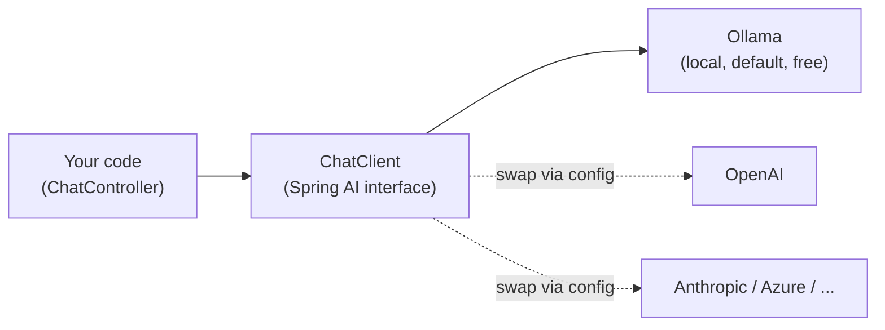
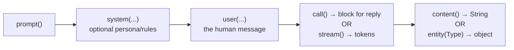
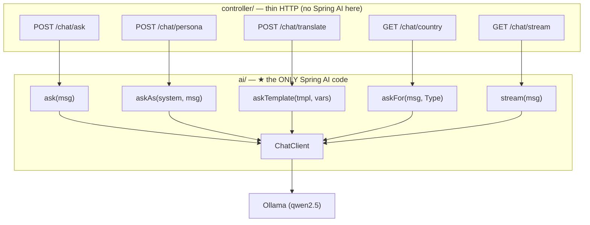
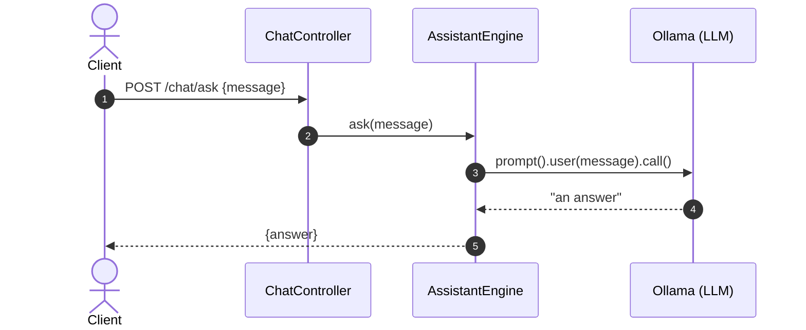
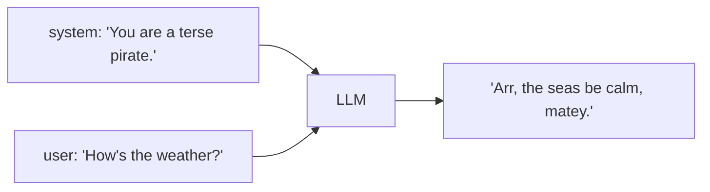
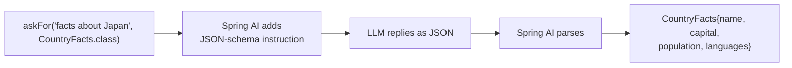
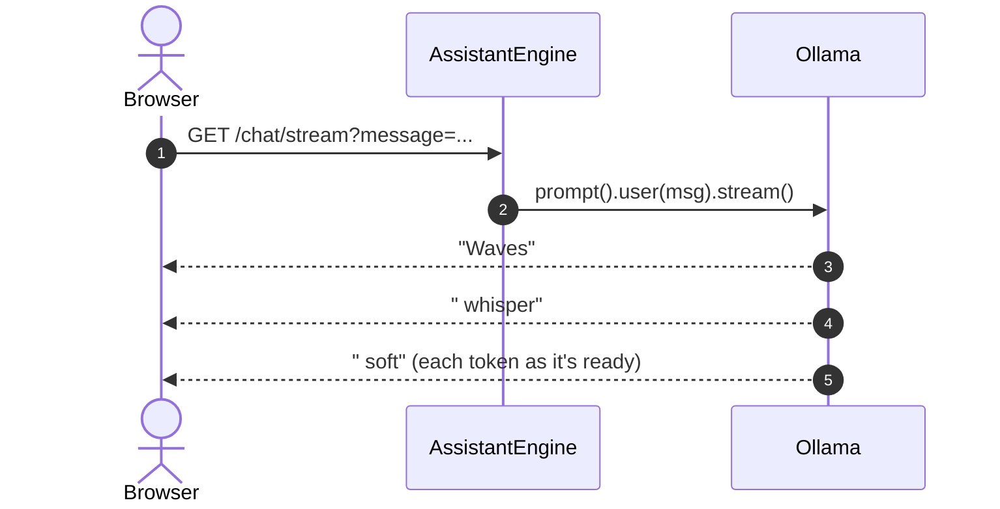
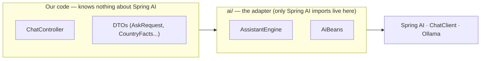
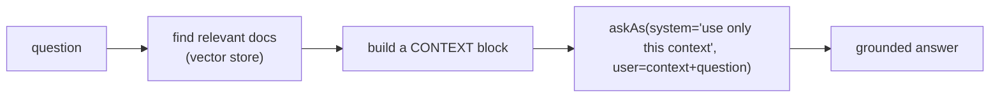

# 🌱 Spring AI, Explained Cleanly (with diagrams)

This is Spring AI stripped to its core — **one `ChatClient`, five patterns**. Once
these click, everything else in the AI ecosystem (RAG, agents, tools) is just these
same primitives arranged differently.

> The diagrams below are **Mermaid** — they render automatically on GitHub. In a
> plain editor the blocks still read top-to-bottom.

---

## 1. What is Spring AI?

**Spring AI** is Spring's official framework for talking to AI models the "Spring
way" — auto-configuration, dependency injection, and one **portable** API.

Without it, every provider is a different hand-rolled HTTP + JSON integration. With
it, you inject **one interface** and choose the provider in `application.yml`.



`ChatClient` is to AI what `JdbcTemplate` is to databases: a clean, high-level
client that hides the provider's wire format.

---

## 2. The one API you must know

Every call is a variation of this fluent chain:



That's it. The five endpoints below just pick different branches of this chain.

---

## 3. The five patterns (mapped to real methods)

Every method lives in **`AssistantEngine`** — the only class that imports
`org.springframework.ai.*`.



### 3.1 Ask — the "hello world"
`prompt().user(msg).call().content()` — text in, text out.



### 3.2 Persona — a system prompt steers behaviour
The **system** prompt sets *who the model is*; the **user** prompt is *the request*.



Same user question + different system prompt = different answer. This is the single
most powerful knob you have.

### 3.3 Template — reuse a prompt, vary the inputs
Keep a stable, tested prompt with `{placeholders}`; Spring AI fills them per call.

```
template = "Translate '{text}' into {language}. Reply with ONLY the translation."
params   = { text: "Good morning", language: "French" }
          ─────────────────────────────────────────────►  "Bonjour"
```

### 3.4 Structured output — a typed object, not a String
Ask for a Java type; Spring AI adds "reply as JSON like this schema" and parses it.



You never touch JSON — you get a real object.

### 3.5 Streaming — tokens as they're generated
`stream().content()` returns a `Flux<String>`; the controller serves it as
Server-Sent Events (the "typing" effect).



---

## 4. The isolation boundary (the "why")



| Decision                              | Why                                                                 |
|---------------------------------------|---------------------------------------------------------------------|
| **Spring AI isolated in `ai/`**       | Controller depends on our methods; provider/model swap = config only |
| **Ollama by default**                 | Free & local — no API key, no cloud bill                            |
| **One `AiUnavailableException`**      | Every provider failure becomes 503 at a single boundary            |
| **`.entity(Type)` for structured out**| No manual JSON parsing; you get a real Java object                 |

This is **ports & adapters** (hexagonal) — the exact move the QR project makes with
ZXing and the OTP project makes with JJWT.

---

## 5. How this grows into RAG

RAG (the [`05-ai-rag-service`](../../05-ai-rag-service) project) is **not** a new
Spring AI feature — it's these primitives plus a search step:



If you understand `askAs` here, RAG is just: *retrieve first, then call it.*

---

## 6. Glossary

| Term                  | Plain-English meaning                                                     |
|-----------------------|--------------------------------------------------------------------------|
| **LLM**               | Large Language Model — the thing that writes the answer (e.g. Llama 3.2)  |
| **ChatClient**        | Spring AI's high-level client for chatting with an LLM                    |
| **System prompt**     | Instruction that sets the model's role/behaviour for the whole request   |
| **User prompt**       | The actual message/request from the human                                |
| **Prompt template**   | A reusable prompt string with `{placeholders}` filled at call time       |
| **Structured output** | Mapping the model's reply straight into a typed Java object              |
| **Streaming**         | Receiving the answer token-by-token instead of all at once               |
| **Ollama**            | A tool that runs open LLMs locally over HTTP (:11434), for free          |

---

## 7. Where to go next

- **README.md** — architecture, running locally, copy-paste `curl`s, interview Q&A.
- **Swagger UI** — <http://localhost:8080/api/swagger-ui.html>